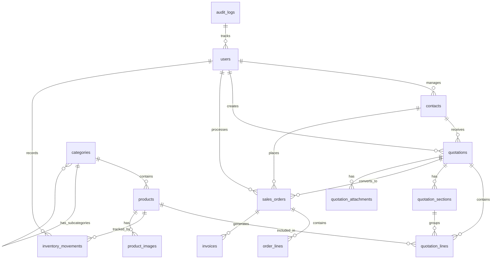

# MyERP Database Schema

## Database Design Overview

The database follows a normalized relational design with PostgreSQL as the RDBMS. The schema is designed to support multi-tenancy, auditing, and scalability.

## Entity Relationship Diagram



## Detailed Table Schemas

### Core Tables

#### 1. users
```sql
CREATE TABLE users (
    id UUID PRIMARY KEY DEFAULT gen_random_uuid(),
    email VARCHAR(255) UNIQUE NOT NULL,
    password_hash VARCHAR(255) NOT NULL,
    first_name VARCHAR(100) NOT NULL,
    last_name VARCHAR(100) NOT NULL,
    role VARCHAR(20) NOT NULL CHECK (role IN ('admin', 'sales', 'viewer')),
    is_active BOOLEAN DEFAULT true,
    phone VARCHAR(20),
    avatar_url VARCHAR(500),
    last_login TIMESTAMP,
    failed_login_attempts INTEGER DEFAULT 0,
    locked_until TIMESTAMP,
    created_at TIMESTAMP DEFAULT CURRENT_TIMESTAMP,
    updated_at TIMESTAMP DEFAULT CURRENT_TIMESTAMP,
    deleted_at TIMESTAMP
);

CREATE INDEX idx_users_email ON users(email);
CREATE INDEX idx_users_role ON users(role);
CREATE INDEX idx_users_active ON users(is_active) WHERE is_active = true;
```

#### 2. contacts
```sql
CREATE TABLE contacts (
    id UUID PRIMARY KEY DEFAULT gen_random_uuid(),
    contact_code VARCHAR(50) UNIQUE NOT NULL,
    first_name VARCHAR(100) NOT NULL,
    last_name VARCHAR(100) NOT NULL,
    email VARCHAR(255),
    phone VARCHAR(20),
    mobile VARCHAR(20),
    company_name VARCHAR(200),
    job_title VARCHAR(100),
    address_street VARCHAR(200),
    address_city VARCHAR(100),
    address_state VARCHAR(100),
    address_zip VARCHAR(20),
    address_country VARCHAR(100),
    tax_id VARCHAR(50),
    customer_type VARCHAR(20) CHECK (customer_type IN ('individual', 'company')),
    credit_limit DECIMAL(12,2) DEFAULT 0,
    payment_terms INTEGER DEFAULT 30, -- days
    notes TEXT,
    tags TEXT[], -- Array of tags
    assigned_to UUID REFERENCES users(id),
    created_by UUID REFERENCES users(id),
    is_active BOOLEAN DEFAULT true,
    created_at TIMESTAMP DEFAULT CURRENT_TIMESTAMP,
    updated_at TIMESTAMP DEFAULT CURRENT_TIMESTAMP,
    deleted_at TIMESTAMP
);

CREATE INDEX idx_contacts_email ON contacts(email);
CREATE INDEX idx_contacts_company ON contacts(company_name);
CREATE INDEX idx_contacts_assigned ON contacts(assigned_to);
CREATE INDEX idx_contacts_code ON contacts(contact_code);
CREATE INDEX idx_contacts_tags ON contacts USING GIN(tags);
```

#### 3. categories
```sql
CREATE TABLE categories (
    id UUID PRIMARY KEY DEFAULT gen_random_uuid(),
    name VARCHAR(100) NOT NULL,
    slug VARCHAR(100) UNIQUE NOT NULL,
    parent_id UUID REFERENCES categories(id) ON DELETE CASCADE,
    description TEXT,
    display_order INTEGER DEFAULT 0,
    is_active BOOLEAN DEFAULT true,
    created_at TIMESTAMP DEFAULT CURRENT_TIMESTAMP,
    updated_at TIMESTAMP DEFAULT CURRENT_TIMESTAMP
);

CREATE INDEX idx_categories_parent ON categories(parent_id);
CREATE INDEX idx_categories_slug ON categories(slug);
```

#### 4. products
```sql
CREATE TABLE products (
    id UUID PRIMARY KEY DEFAULT gen_random_uuid(),
    sku VARCHAR(100) UNIQUE NOT NULL,
    name VARCHAR(200) NOT NULL,
    description TEXT,
    category_id UUID REFERENCES categories(id),
    unit_price DECIMAL(12,2) NOT NULL,
    cost_price DECIMAL(12,2),
    quantity INTEGER DEFAULT 0,
    reserved_quantity INTEGER DEFAULT 0, -- For pending orders
    min_stock_level INTEGER DEFAULT 0,
    max_stock_level INTEGER,
    unit_of_measure VARCHAR(20) DEFAULT 'piece',
    weight DECIMAL(8,3), -- in kg
    dimensions_length DECIMAL(8,2), -- in cm
    dimensions_width DECIMAL(8,2),
    dimensions_height DECIMAL(8,2),
    tax_rate DECIMAL(5,2) DEFAULT 0,
    barcode VARCHAR(100),
    supplier_id UUID REFERENCES contacts(id),
    lead_time_days INTEGER DEFAULT 0,
    is_active BOOLEAN DEFAULT true,
    is_service BOOLEAN DEFAULT false,
    track_inventory BOOLEAN DEFAULT true,
    created_at TIMESTAMP DEFAULT CURRENT_TIMESTAMP,
    updated_at TIMESTAMP DEFAULT CURRENT_TIMESTAMP,
    deleted_at TIMESTAMP
);

CREATE INDEX idx_products_sku ON products(sku);
CREATE INDEX idx_products_name ON products(name);
CREATE INDEX idx_products_category ON products(category_id);
CREATE INDEX idx_products_supplier ON products(supplier_id);
CREATE INDEX idx_products_active ON products(is_active) WHERE is_active = true;
```

#### 5. product_images
```sql
CREATE TABLE product_images (
    id UUID PRIMARY KEY DEFAULT gen_random_uuid(),
    product_id UUID REFERENCES products(id) ON DELETE CASCADE,
    image_url VARCHAR(500) NOT NULL,
    thumbnail_url VARCHAR(500),
    display_order INTEGER DEFAULT 0,
    is_primary BOOLEAN DEFAULT false,
    created_at TIMESTAMP DEFAULT CURRENT_TIMESTAMP
);

CREATE INDEX idx_product_images_product ON product_images(product_id);
```

#### 6. quotations
```sql
CREATE TABLE quotations (
    id UUID PRIMARY KEY DEFAULT gen_random_uuid(),
    quotation_number VARCHAR(50) UNIQUE NOT NULL,
    contact_id UUID REFERENCES contacts(id),
    sales_rep_id UUID REFERENCES users(id),
    status VARCHAR(20) NOT NULL DEFAULT 'draft'
        CHECK (status IN ('draft', 'sent', 'accepted', 'rejected', 'expired', 'cancelled')),
    expiration_date DATE,
    delivery_date DATE,
    payment_terms VARCHAR(200),
    delivery_terms VARCHAR(200),
    shipping_method VARCHAR(100),
    currency VARCHAR(3) DEFAULT 'USD',
    exchange_rate DECIMAL(10,6) DEFAULT 1,
    subtotal DECIMAL(12,2) DEFAULT 0,
    tax_amount DECIMAL(12,2) DEFAULT 0,
    shipping_cost DECIMAL(12,2) DEFAULT 0,
    discount_percent DECIMAL(5,2) DEFAULT 0,
    discount_amount DECIMAL(12,2) DEFAULT 0,
    total_amount DECIMAL(12,2) DEFAULT 0,
    notes TEXT,
    internal_notes TEXT, -- Not shown to customer
    terms_conditions TEXT,
    reference_number VARCHAR(100), -- Customer PO number
    version INTEGER DEFAULT 1,
    parent_quotation_id UUID REFERENCES quotations(id), -- For versioning
    sent_at TIMESTAMP,
    viewed_at TIMESTAMP,
    accepted_at TIMESTAMP,
    rejected_at TIMESTAMP,
    rejection_reason TEXT,
    created_at TIMESTAMP DEFAULT CURRENT_TIMESTAMP,
    updated_at TIMESTAMP DEFAULT CURRENT_TIMESTAMP,
    deleted_at TIMESTAMP
);

CREATE INDEX idx_quotations_number ON quotations(quotation_number);
CREATE INDEX idx_quotations_contact ON quotations(contact_id);
CREATE INDEX idx_quotations_sales_rep ON quotations(sales_rep_id);
CREATE INDEX idx_quotations_status ON quotations(status);
CREATE INDEX idx_quotations_expiration ON quotations(expiration_date);
CREATE INDEX idx_quotations_created ON quotations(created_at);
```

#### 7. quotation_sections
```sql
CREATE TABLE quotation_sections (
    id UUID PRIMARY KEY DEFAULT gen_random_uuid(),
    quotation_id UUID REFERENCES quotations(id) ON DELETE CASCADE,
    name VARCHAR(200) NOT NULL,
    description TEXT,
    display_order INTEGER DEFAULT 0,
    subtotal DECIMAL(12,2) DEFAULT 0,
    created_at TIMESTAMP DEFAULT CURRENT_TIMESTAMP
);

CREATE INDEX idx_quotation_sections_quotation ON quotation_sections(quotation_id);
```

#### 8. quotation_lines
```sql
CREATE TABLE quotation_lines (
    id UUID PRIMARY KEY DEFAULT gen_random_uuid(),
    quotation_id UUID REFERENCES quotations(id) ON DELETE CASCADE,
    product_id UUID REFERENCES products(id),
    section_id UUID REFERENCES quotation_sections(id) ON DELETE SET NULL,
    line_number INTEGER NOT NULL,
    product_sku VARCHAR(100),
    product_name VARCHAR(200) NOT NULL,
    description TEXT,
    quantity DECIMAL(10,3) NOT NULL,
    unit_price DECIMAL(12,2) NOT NULL,
    discount_percent DECIMAL(5,2) DEFAULT 0,
    discount_amount DECIMAL(12,2) DEFAULT 0,
    tax_rate DECIMAL(5,2) DEFAULT 0,
    tax_amount DECIMAL(12,2) DEFAULT 0,
    line_total DECIMAL(12,2) NOT NULL,
    cost_price DECIMAL(12,2), -- For margin calculation
    notes TEXT,
    is_optional BOOLEAN DEFAULT false,
    created_at TIMESTAMP DEFAULT CURRENT_TIMESTAMP,
    updated_at TIMESTAMP DEFAULT CURRENT_TIMESTAMP
);

CREATE INDEX idx_quotation_lines_quotation ON quotation_lines(quotation_id);
CREATE INDEX idx_quotation_lines_product ON quotation_lines(product_id);
CREATE INDEX idx_quotation_lines_section ON quotation_lines(section_id);
```

#### 9. sales_orders
```sql
CREATE TABLE sales_orders (
    id UUID PRIMARY KEY DEFAULT gen_random_uuid(),
    order_number VARCHAR(50) UNIQUE NOT NULL,
    quotation_id UUID REFERENCES quotations(id),
    contact_id UUID REFERENCES contacts(id),
    sales_rep_id UUID REFERENCES users(id),
    order_date DATE NOT NULL DEFAULT CURRENT_DATE,
    status VARCHAR(20) NOT NULL DEFAULT 'pending'
        CHECK (status IN ('pending', 'confirmed', 'processing', 'shipped', 'delivered', 'cancelled')),
    payment_status VARCHAR(20) DEFAULT 'pending'
        CHECK (payment_status IN ('pending', 'partial', 'paid', 'refunded')),
    payment_method VARCHAR(50),
    payment_reference VARCHAR(100),
    delivery_status VARCHAR(20) DEFAULT 'pending'
        CHECK (delivery_status IN ('pending', 'processing', 'ready', 'shipped', 'delivered')),
    delivery_date DATE,
    shipping_address_street VARCHAR(200),
    shipping_address_city VARCHAR(100),
    shipping_address_state VARCHAR(100),
    shipping_address_zip VARCHAR(20),
    shipping_address_country VARCHAR(100),
    billing_address_street VARCHAR(200),
    billing_address_city VARCHAR(100),
    billing_address_state VARCHAR(100),
    billing_address_zip VARCHAR(20),
    billing_address_country VARCHAR(100),
    tracking_number VARCHAR(100),
    invoice_number VARCHAR(50),
    currency VARCHAR(3) DEFAULT 'USD',
    subtotal DECIMAL(12,2) DEFAULT 0,
    tax_amount DECIMAL(12,2) DEFAULT 0,
    shipping_cost DECIMAL(12,2) DEFAULT 0,
    discount_amount DECIMAL(12,2) DEFAULT 0,
    total_amount DECIMAL(12,2) DEFAULT 0,
    paid_amount DECIMAL(12,2) DEFAULT 0,
    notes TEXT,
    internal_notes TEXT,
    created_at TIMESTAMP DEFAULT CURRENT_TIMESTAMP,
    updated_at TIMESTAMP DEFAULT CURRENT_TIMESTAMP,
    delivered_at TIMESTAMP,
    cancelled_at TIMESTAMP,
    cancellation_reason TEXT
);

CREATE INDEX idx_sales_orders_number ON sales_orders(order_number);
CREATE INDEX idx_sales_orders_quotation ON sales_orders(quotation_id);
CREATE INDEX idx_sales_orders_contact ON sales_orders(contact_id);
CREATE INDEX idx_sales_orders_sales_rep ON sales_orders(sales_rep_id);
CREATE INDEX idx_sales_orders_status ON sales_orders(status);
CREATE INDEX idx_sales_orders_payment_status ON sales_orders(payment_status);
CREATE INDEX idx_sales_orders_created ON sales_orders(created_at);
```

#### 10. order_lines
```sql
CREATE TABLE order_lines (
    id UUID PRIMARY KEY DEFAULT gen_random_uuid(),
    order_id UUID REFERENCES sales_orders(id) ON DELETE CASCADE,
    product_id UUID REFERENCES products(id),
    line_number INTEGER NOT NULL,
    product_sku VARCHAR(100),
    product_name VARCHAR(200) NOT NULL,
    description TEXT,
    quantity DECIMAL(10,3) NOT NULL,
    delivered_quantity DECIMAL(10,3) DEFAULT 0,
    unit_price DECIMAL(12,2) NOT NULL,
    discount_amount DECIMAL(12,2) DEFAULT 0,
    tax_amount DECIMAL(12,2) DEFAULT 0,
    line_total DECIMAL(12,2) NOT NULL,
    cost_price DECIMAL(12,2),
    created_at TIMESTAMP DEFAULT CURRENT_TIMESTAMP
);

CREATE INDEX idx_order_lines_order ON order_lines(order_id);
CREATE INDEX idx_order_lines_product ON order_lines(product_id);
```

#### 11. inventory_movements
```sql
CREATE TABLE inventory_movements (
    id UUID PRIMARY KEY DEFAULT gen_random_uuid(),
    product_id UUID REFERENCES products(id),
    movement_type VARCHAR(20) NOT NULL
        CHECK (movement_type IN ('in', 'out', 'adjustment', 'transfer', 'return')),
    quantity DECIMAL(10,3) NOT NULL,
    quantity_before DECIMAL(10,3),
    quantity_after DECIMAL(10,3),
    unit_cost DECIMAL(12,2),
    reference_type VARCHAR(50), -- 'sales_order', 'purchase_order', 'adjustment', etc.
    reference_id UUID,
    reference_number VARCHAR(100),
    location_from VARCHAR(100),
    location_to VARCHAR(100),
    reason VARCHAR(200),
    notes TEXT,
    created_by UUID REFERENCES users(id),
    created_at TIMESTAMP DEFAULT CURRENT_TIMESTAMP
);

CREATE INDEX idx_inventory_movements_product ON inventory_movements(product_id);
CREATE INDEX idx_inventory_movements_type ON inventory_movements(movement_type);
CREATE INDEX idx_inventory_movements_reference ON inventory_movements(reference_type, reference_id);
CREATE INDEX idx_inventory_movements_created ON inventory_movements(created_at);
```

#### 12. quotation_attachments
```sql
CREATE TABLE quotation_attachments (
    id UUID PRIMARY KEY DEFAULT gen_random_uuid(),
    quotation_id UUID REFERENCES quotations(id) ON DELETE CASCADE,
    file_name VARCHAR(255) NOT NULL,
    file_url VARCHAR(500) NOT NULL,
    file_size INTEGER,
    mime_type VARCHAR(100),
    uploaded_by UUID REFERENCES users(id),
    created_at TIMESTAMP DEFAULT CURRENT_TIMESTAMP
);

CREATE INDEX idx_quotation_attachments_quotation ON quotation_attachments(quotation_id);
```

#### 13. invoices
```sql
CREATE TABLE invoices (
    id UUID PRIMARY KEY DEFAULT gen_random_uuid(),
    invoice_number VARCHAR(50) UNIQUE NOT NULL,
    order_id UUID REFERENCES sales_orders(id),
    contact_id UUID REFERENCES contacts(id),
    invoice_date DATE NOT NULL DEFAULT CURRENT_DATE,
    due_date DATE,
    status VARCHAR(20) DEFAULT 'draft'
        CHECK (status IN ('draft', 'sent', 'paid', 'partial', 'overdue', 'cancelled')),
    subtotal DECIMAL(12,2) DEFAULT 0,
    tax_amount DECIMAL(12,2) DEFAULT 0,
    total_amount DECIMAL(12,2) DEFAULT 0,
    paid_amount DECIMAL(12,2) DEFAULT 0,
    notes TEXT,
    created_at TIMESTAMP DEFAULT CURRENT_TIMESTAMP,
    updated_at TIMESTAMP DEFAULT CURRENT_TIMESTAMP
);

CREATE INDEX idx_invoices_number ON invoices(invoice_number);
CREATE INDEX idx_invoices_order ON invoices(order_id);
CREATE INDEX idx_invoices_contact ON invoices(contact_id);
CREATE INDEX idx_invoices_status ON invoices(status);
```

### Audit & System Tables

#### 14. audit_logs
```sql
CREATE TABLE audit_logs (
    id UUID PRIMARY KEY DEFAULT gen_random_uuid(),
    user_id UUID REFERENCES users(id),
    entity_type VARCHAR(50) NOT NULL,
    entity_id UUID NOT NULL,
    action VARCHAR(20) NOT NULL CHECK (action IN ('create', 'update', 'delete', 'view')),
    old_values JSONB,
    new_values JSONB,
    ip_address INET,
    user_agent TEXT,
    created_at TIMESTAMP DEFAULT CURRENT_TIMESTAMP
);

CREATE INDEX idx_audit_logs_user ON audit_logs(user_id);
CREATE INDEX idx_audit_logs_entity ON audit_logs(entity_type, entity_id);
CREATE INDEX idx_audit_logs_created ON audit_logs(created_at);
```

#### 15. email_logs
```sql
CREATE TABLE email_logs (
    id UUID PRIMARY KEY DEFAULT gen_random_uuid(),
    recipient_email VARCHAR(255) NOT NULL,
    subject VARCHAR(500),
    template_name VARCHAR(100),
    reference_type VARCHAR(50),
    reference_id UUID,
    status VARCHAR(20) DEFAULT 'pending'
        CHECK (status IN ('pending', 'sent', 'failed', 'bounced')),
    sent_at TIMESTAMP,
    opened_at TIMESTAMP,
    error_message TEXT,
    created_at TIMESTAMP DEFAULT CURRENT_TIMESTAMP
);

CREATE INDEX idx_email_logs_recipient ON email_logs(recipient_email);
CREATE INDEX idx_email_logs_reference ON email_logs(reference_type, reference_id);
CREATE INDEX idx_email_logs_status ON email_logs(status);
```

#### 16. system_settings
```sql
CREATE TABLE system_settings (
    id UUID PRIMARY KEY DEFAULT gen_random_uuid(),
    key VARCHAR(100) UNIQUE NOT NULL,
    value JSONB NOT NULL,
    description TEXT,
    is_public BOOLEAN DEFAULT false,
    created_at TIMESTAMP DEFAULT CURRENT_TIMESTAMP,
    updated_at TIMESTAMP DEFAULT CURRENT_TIMESTAMP
);

CREATE INDEX idx_system_settings_key ON system_settings(key);
```

## Database Views

### 1. v_product_availability
```sql
CREATE VIEW v_product_availability AS
SELECT
    p.id,
    p.sku,
    p.name,
    p.quantity as stock_quantity,
    p.reserved_quantity,
    (p.quantity - p.reserved_quantity) as available_quantity,
    p.min_stock_level,
    CASE
        WHEN (p.quantity - p.reserved_quantity) <= 0 THEN 'out_of_stock'
        WHEN (p.quantity - p.reserved_quantity) <= p.min_stock_level THEN 'low_stock'
        ELSE 'in_stock'
    END as stock_status
FROM products p
WHERE p.is_active = true AND p.track_inventory = true;
```

### 2. v_sales_performance
```sql
CREATE VIEW v_sales_performance AS
SELECT
    u.id as sales_rep_id,
    u.first_name || ' ' || u.last_name as sales_rep_name,
    COUNT(DISTINCT q.id) as total_quotations,
    COUNT(DISTINCT so.id) as total_orders,
    COALESCE(SUM(CASE WHEN q.status = 'accepted' THEN 1 ELSE 0 END), 0) as accepted_quotations,
    COALESCE(SUM(so.total_amount), 0) as total_revenue,
    COALESCE(AVG(so.total_amount), 0) as average_order_value,
    CASE
        WHEN COUNT(q.id) > 0
        THEN (COUNT(DISTINCT so.id)::DECIMAL / COUNT(DISTINCT q.id) * 100)
        ELSE 0
    END as conversion_rate
FROM users u
LEFT JOIN quotations q ON u.id = q.sales_rep_id
LEFT JOIN sales_orders so ON q.id = so.quotation_id
WHERE u.role IN ('sales', 'admin')
GROUP BY u.id, u.first_name, u.last_name;
```

### 3. v_customer_summary
```sql
CREATE VIEW v_customer_summary AS
SELECT
    c.id,
    c.contact_code,
    c.first_name || ' ' || c.last_name as full_name,
    c.company_name,
    COUNT(DISTINCT q.id) as total_quotations,
    COUNT(DISTINCT so.id) as total_orders,
    COALESCE(SUM(so.total_amount), 0) as lifetime_value,
    MAX(so.order_date) as last_order_date,
    c.credit_limit,
    COALESCE(SUM(CASE WHEN so.payment_status != 'paid' THEN so.total_amount - so.paid_amount ELSE 0 END), 0) as outstanding_balance
FROM contacts c
LEFT JOIN quotations q ON c.id = q.contact_id
LEFT JOIN sales_orders so ON c.id = so.contact_id
WHERE c.is_active = true
GROUP BY c.id, c.contact_code, c.first_name, c.last_name, c.company_name, c.credit_limit;
```

## Database Functions & Triggers

### 1. Update timestamp trigger
```sql
CREATE OR REPLACE FUNCTION update_updated_at_column()
RETURNS TRIGGER AS $$
BEGIN
    NEW.updated_at = CURRENT_TIMESTAMP;
    RETURN NEW;
END;
$$ LANGUAGE plpgsql;

-- Apply to all tables with updated_at column
CREATE TRIGGER update_users_updated_at BEFORE UPDATE ON users
    FOR EACH ROW EXECUTE FUNCTION update_updated_at_column();
CREATE TRIGGER update_contacts_updated_at BEFORE UPDATE ON contacts
    FOR EACH ROW EXECUTE FUNCTION update_updated_at_column();
-- ... (apply to all relevant tables)
```

### 2. Generate unique numbers
```sql
CREATE SEQUENCE quotation_number_seq START 1000;
CREATE SEQUENCE order_number_seq START 1000;
CREATE SEQUENCE invoice_number_seq START 1000;

CREATE OR REPLACE FUNCTION generate_quotation_number()
RETURNS VARCHAR AS $$
DECLARE
    year_month VARCHAR;
    seq_num INTEGER;
BEGIN
    year_month := TO_CHAR(CURRENT_DATE, 'YYYYMM');
    seq_num := NEXTVAL('quotation_number_seq');
    RETURN 'QT-' || year_month || '-' || LPAD(seq_num::TEXT, 5, '0');
END;
$$ LANGUAGE plpgsql;

CREATE OR REPLACE FUNCTION generate_order_number()
RETURNS VARCHAR AS $$
DECLARE
    year_month VARCHAR;
    seq_num INTEGER;
BEGIN
    year_month := TO_CHAR(CURRENT_DATE, 'YYYYMM');
    seq_num := NEXTVAL('order_number_seq');
    RETURN 'SO-' || year_month || '-' || LPAD(seq_num::TEXT, 5, '0');
END;
$$ LANGUAGE plpgsql;
```

### 3. Update inventory on order
```sql
CREATE OR REPLACE FUNCTION update_inventory_on_order()
RETURNS TRIGGER AS $$
BEGIN
    IF TG_OP = 'INSERT' AND NEW.status = 'confirmed' THEN
        -- Reserve inventory
        UPDATE products p
        SET reserved_quantity = reserved_quantity + ol.quantity
        FROM order_lines ol
        WHERE p.id = ol.product_id AND ol.order_id = NEW.id;

    ELSIF TG_OP = 'UPDATE' AND OLD.status != 'delivered' AND NEW.status = 'delivered' THEN
        -- Deduct from inventory and remove reservation
        UPDATE products p
        SET
            quantity = quantity - ol.quantity,
            reserved_quantity = reserved_quantity - ol.quantity
        FROM order_lines ol
        WHERE p.id = ol.product_id AND ol.order_id = NEW.id;

        -- Create inventory movement records
        INSERT INTO inventory_movements (
            product_id, movement_type, quantity, reference_type, reference_id, created_by
        )
        SELECT
            ol.product_id, 'out', ol.quantity, 'sales_order', NEW.id, NEW.sales_rep_id
        FROM order_lines ol
        WHERE ol.order_id = NEW.id;

    ELSIF TG_OP = 'UPDATE' AND OLD.status != 'cancelled' AND NEW.status = 'cancelled' THEN
        -- Release reserved inventory
        UPDATE products p
        SET reserved_quantity = reserved_quantity - ol.quantity
        FROM order_lines ol
        WHERE p.id = ol.product_id AND ol.order_id = NEW.id;
    END IF;

    RETURN NEW;
END;
$$ LANGUAGE plpgsql;

CREATE TRIGGER trigger_update_inventory_on_order
AFTER INSERT OR UPDATE ON sales_orders
FOR EACH ROW EXECUTE FUNCTION update_inventory_on_order();
```

### 4. Calculate totals
```sql
CREATE OR REPLACE FUNCTION calculate_quotation_totals()
RETURNS TRIGGER AS $$
DECLARE
    v_subtotal DECIMAL(12,2);
    v_tax_total DECIMAL(12,2);
BEGIN
    -- Calculate subtotal and tax from lines
    SELECT
        COALESCE(SUM(line_total), 0),
        COALESCE(SUM(tax_amount), 0)
    INTO v_subtotal, v_tax_total
    FROM quotation_lines
    WHERE quotation_id = COALESCE(NEW.quotation_id, OLD.quotation_id);

    -- Update quotation totals
    UPDATE quotations
    SET
        subtotal = v_subtotal,
        tax_amount = v_tax_total,
        total_amount = v_subtotal + v_tax_total + shipping_cost - discount_amount
    WHERE id = COALESCE(NEW.quotation_id, OLD.quotation_id);

    RETURN NEW;
END;
$$ LANGUAGE plpgsql;

CREATE TRIGGER trigger_calculate_quotation_totals
AFTER INSERT OR UPDATE OR DELETE ON quotation_lines
FOR EACH ROW EXECUTE FUNCTION calculate_quotation_totals();
```

## Indexes Strategy

### Performance Indexes
- Primary keys: UUID with gen_random_uuid() for distributed systems
- Foreign keys: All have corresponding indexes
- Search fields: email, name, SKU, quotation numbers
- Date fields: created_at, order_date for reporting
- Status fields: for filtering
- Composite indexes for common queries

### Example Composite Indexes
```sql
-- For dashboard queries
CREATE INDEX idx_orders_dashboard ON sales_orders(sales_rep_id, created_at, status);
CREATE INDEX idx_quotations_dashboard ON quotations(sales_rep_id, created_at, status);

-- For inventory checks
CREATE INDEX idx_products_inventory ON products(is_active, track_inventory, quantity);

-- For customer history
CREATE INDEX idx_contact_history ON quotations(contact_id, created_at DESC);
```

## Data Integrity Rules

### 1. Business Rules
- A quotation can only be converted to a sales order once
- Inventory cannot go negative
- Quotation expiration date must be future date when created
- Order delivery date must be after order date
- Discount cannot exceed 100%
- Tax rate must be between 0 and 100

### 2. Referential Integrity
- Soft deletes with deleted_at timestamp
- Cascade deletes only for child records (lines, attachments)
- Restrict deletes for referenced master data
- Set NULL for optional relationships

### 3. Data Validation
- Email format validation
- Phone number format validation
- Positive numbers for quantities and amounts
- Valid status transitions
- Currency code validation (ISO 4217)

## Backup and Recovery Strategy

### 1. Backup Types
- **Full Backup**: Daily at 2:00 AM
- **Incremental Backup**: Every 6 hours
- **Transaction Logs**: Continuous archiving

### 2. Backup Storage
- Local: Last 7 days
- Cloud Storage: Last 30 days
- Archive: Monthly backups for 1 year

### 3. Recovery Procedures
- Point-in-time recovery capability
- RTO (Recovery Time Objective): 4 hours
- RPO (Recovery Point Objective): 1 hour

## Performance Optimization

### 1. Partitioning Strategy
- Partition large tables by date (audit_logs, inventory_movements)
- Partition by status for active records

### 2. Archiving Strategy
- Archive completed orders older than 2 years
- Archive audit logs older than 1 year
- Maintain summary tables for historical reporting

### 3. Query Optimization
- Use materialized views for complex reports
- Implement query result caching
- Database connection pooling
- Read replicas for reporting queries

## Security Measures

### 1. Access Control
- Row-level security for multi-tenant data
- Column-level encryption for sensitive data
- SSL/TLS for connections
- Audit all data modifications

### 2. Data Protection
- Encrypt passwords with bcrypt
- Encrypt sensitive fields (tax_id, credit card info)
- PII data masking for non-production environments
- Regular security audits

## Migration Strategy

### 1. Version Control
- All schema changes in migration files
- Rollback procedures for each migration
- Migration testing in staging environment

### 2. Zero-Downtime Migrations
- Use CREATE INDEX CONCURRENTLY
- Add columns as nullable first
- Batch data updates
- Blue-green deployment support